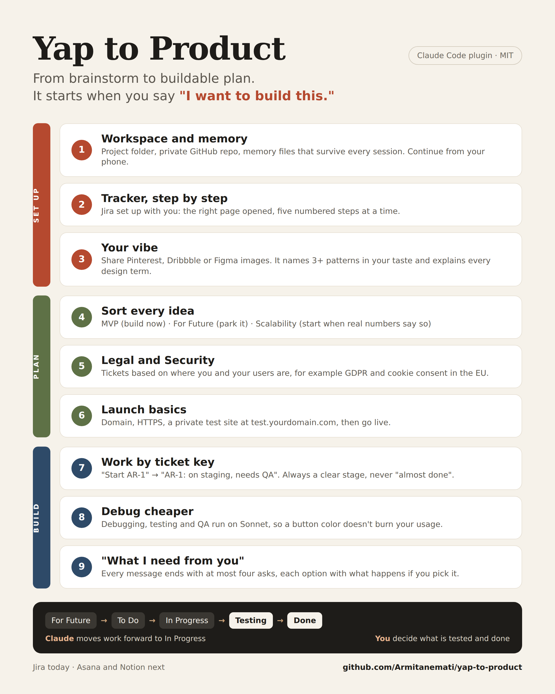
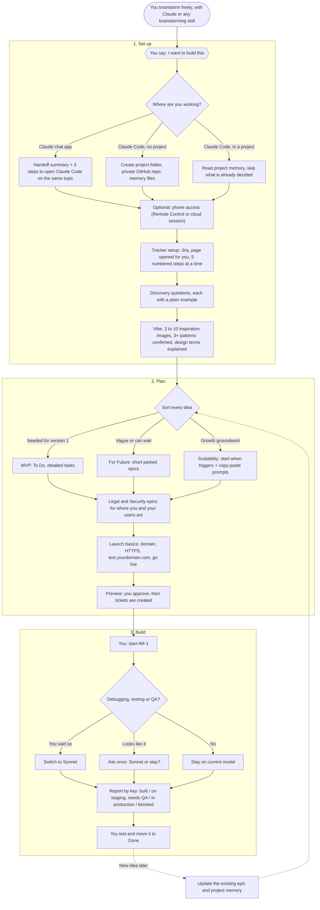

# Yap to Product

From brainstorm to buildable plan. A Claude plugin that takes over when you stop imagining and say "let's build it".

It sets up your workspace and task tracker with you, learns your taste from inspiration images, sorts your ideas into a phased plan, covers legal and security basics for where you operate, walks you through the setup only you can do one numbered step at a time, and reports progress ticket by ticket.



## How it works

1. **You brainstorm** however you like, with Claude or another brainstorming skill.
2. **You say "I want to build this"** (or "help me build it", or "just write my ideas down"). The skill activates.
3. **Workspace and memory.** It suggests Claude Code, sets up a project folder, a private GitHub repo, and memory files, so your decisions and inspiration survive between sessions.
4. **Tracker setup.** It opens the signup page (or links it) and guides you step by step. Jira is supported today.
5. **Vibe.** You share three to ten inspiration images (Pinterest, Dribbble, Figma, screenshots). It finds at least three patterns, checks them with you, and explains every design term with an example.
6. **Your ideas, sorted:**
   - **MVP:** the first version you will actually use, with detailed tasks
   - **For Future:** ideas that can wait, kept short until you need them
   - **Scalability:** servers, CI/CD, monitoring, backups, and more, each with a "start when" trigger and a copy-paste prompt
7. **Legal and Security.** It asks where you and your users are, then creates Legal and Security epics for your situation (for example GDPR and cookie consent in the EU), based on current official sources. It does as much as it can and asks you only for decisions.
8. **Launch basics:** domain, HTTPS, an optional staging site at `test.yourdomain.com`, and go-live, each with a guided walkthrough.
9. **Build by ticket key.** Say "start AR-1" and it works on that ticket, then reports its stage: in progress, built but not deployed, on staging and needs QA, in production, or blocked.
10. **Debug cheaper.** Debugging, testing, and QA run on Sonnet. If you say it is debugging, it switches without asking; if it only looks like debugging, it asks once.

## Detailed flow



## How it talks to you

Every message that needs something from you ends with a short **"What I need from you"** list of at most four bullets. Choices come as options, each with what happens if you pick it. You can skip everything else and still know what to do.

## Guided setup

Whenever you need to do something yourself, Claude:
- opens the exact page in your browser (with Claude in Chrome) or gives you the direct link,
- gives at most five numbered steps,
- waits for you to confirm, checks the result, and updates your tracker.

Claude never types your passwords, pays for anything, or accepts terms for you.

## Works best in Claude Code

If you start in a Claude chat app, the skill suggests moving to Claude Code. It writes a handoff summary so you continue the same topic there, and walks you through installing and opening it in three steps. In Claude Code it can also:
- create a project folder with memory files and a private GitHub repository,
- run debugging and QA on Sonnet automatically,
- let you keep talking to the project from your phone, through Remote Control (your computer stays on) or a cloud session on your GitHub repository (your computer can be off).

## Supported trackers

| Tracker | Status |
|---|---|
| Jira | Supported |
| Asana | Planned |
| Notion | Planned |

## Status rules

| Move | Who |
|---|---|
| For Future to To Do | Claude (when you bring it into scope) |
| To Do to In Progress | Claude (when you say "start AR-1") |
| In Progress to Testing or Done | You |
| Close a task you declined | Claude, only when you say you don't want it |

## Install

**Claude Code (recommended):**

```
/plugin marketplace add Armitanemati/yap-to-product
/plugin install yap-to-product@yap-to-product
```

**Claude apps (skill only):** download the `plugins/yap-to-product/skills/yap-to-product` folder, zip it, and upload it as a skill. Automatic model switching needs Claude Code; in the apps, Claude tells you how to switch models yourself.

## Requirements

- A paid Claude plan for Claude Code (Pro, Max, Team, or Enterprise) or a Claude Console account
- A Jira Cloud account (the free plan works) and a Jira connection for Claude; the skill guides you through both
- Optional: Claude in Chrome, so Claude can open setup pages for you

## Repository layout

```
.claude-plugin/marketplace.json
plugins/yap-to-product/
  .claude-plugin/plugin.json
  agents/quick-fix.md                  Sonnet helper for debugging, QA, small fixes
  skills/yap-to-product/
    SKILL.md                           the method
    trackers/jira.md                   Jira adapter and ticket stages
    references/workspace.md            Claude Code, project folder, memory, GitHub, phone
    references/vibe.md                 inspiration, patterns, design terms explained
    references/legal-security.md       location-based Legal and Security epics
    references/guided-setup.md         step-by-step setup guides with links
    references/scalability.md          scalability tasks and prompts
docs/flow.png                          overview diagram
```

## Limitations

- Legal and security output is practical guidance, not legal advice. Items that need a professional are labeled `needs-professional-review`.
- Claude creates tasks and guides you; it does not register domains, change DNS, or provision servers for you.
- Provider pages change. Links are starting points; Claude adapts to what is on your screen.
- The status rules are instructions to Claude, not locks. To enforce them, restrict the transitions into Testing and Done in your tracker's workflow settings.
- Pinterest links often need a login; uploading the images works more reliably.
- Model switching saves usage only if your main model costs more than Sonnet.
- Phone access through Remote Control needs your computer on with Claude Code running. Cloud sessions run without your computer but do not load plugins installed on it.

## Privacy

The plugin does not read or store credentials and only works in the project you confirm. Project memory lives in files in your own project folder. All examples are fictional.

## License

MIT. See `LICENSE`.
